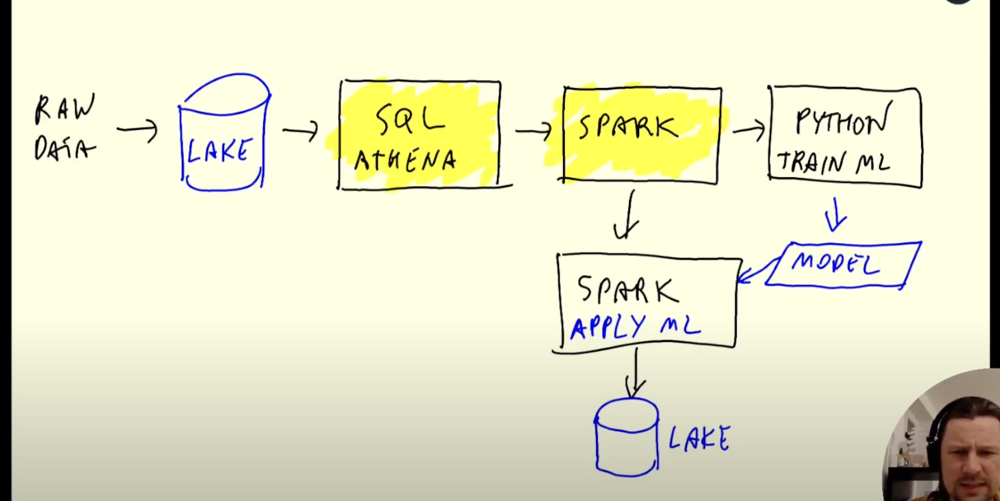
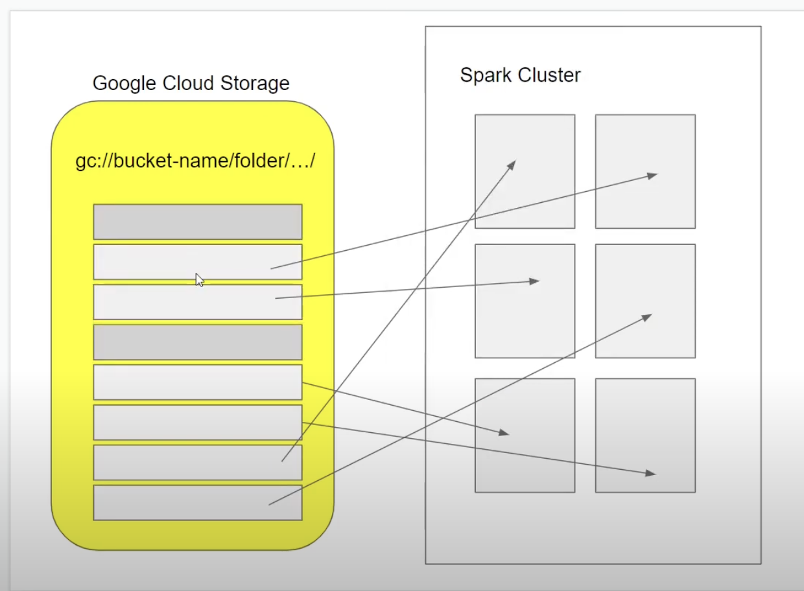

# Batch Processing with Spark

When to use spark
- spark is used for processing large datasets. There are sql-based tools like Athena, Hive, Presto that allow you to process raw data in the data lake as well. As a general rule, whereever it's possible to express your processing logic in sql, use sql. For complex data processing like ML, use spark.
  
Steps
- Install spark and pyspark on mac, [guide here](https://github.com/DataTalksClub/data-engineering-zoomcamp/blob/main/week_5_batch_processing/setup/macos.md)
- Install java, scala, spark etc and set the paths as below
- All about the paths 
  - Java
  ```bash
    brew info java # returns java path
    # add the following to ~/.zshrc
    export JAVA_HOME="/opt/homebrew/opt/openjdk"
    export PATH="$JAVA_HOME/bin/:$PATH"     
  ```
  - Spark
  ```bash
    brew info apache-spark
    # add following to ~/.zshrc
    export SPARK_HOME=/opt/homebrew/Cellar/apache-spark/3.5.0/libexec
    export PATH="$SPARK_HOME/bin/:$PATH"
  ```
  - Pyspark
  ```bash
    # check py4j version ls ${SPARK_HOME}/python/lib/
    # use that, which is - py4j-0.10.9.7-src.zip for me
    export PYTHONPATH="${SPARK_HOME}/python/:$PYTHONPATH"
    export PYTHONPATH="${SPARK_HOME}/python/lib/py4j-0.10.9.7-src.zip:$PYTHONPATH"
  ``` 
  ```bash
    # to implement the changes
    source ~/.zshrc
  ```
- For installing spark on cloud, [instructions](https://github.com/DataTalksClub/data-engineering-zoomcamp/blob/main/week_5_batch_processing/code/cloud.md)
- This installs pyspark in your system python, so you can access it through command prompt (Try `pyspark` in bash).
- This setup does not work with anaconda jupyter as conda uses separate python.
- To access pyspark through jupyter, start jupyter from command line
    ```bash
    jupyer notebook
    # or
    jupyter notebook <notebook.ipynb>
    ```
    Make sure you have set your pyspark path before starting jupyter using 
    ```bash
    export PYTHONPATH="${SPARK_HOME}/python/:$PYTHONPATH"
    export PYTHONPATH="${SPARK_HOME}/python/lib/py4j-0.10.9.7-src.zip:$PYTHONPATH"
    ```
    If you are running spark on cloud, you need to forward ports for jupyter (8888) and spark Master UI (4040). You can do so in VScode
- Download the taxi data for yellow and green taxi for 2020 and 2021 data using `download_data.sh` script
  - give execute permissions to the script
     ```bash
     chmod +x download_data.sh
     ./download_data.sh green 2020
     ./download_data.sh green 2021
     ./download_data.sh yellow 2020
     ./download_data.sh yellow 2021
     ```
  
- Spark concept: Partioning
  - Say you have 10 files to process and your spark cluster has 8 executors - each executor will pick a file and start processing 8 files parallely, when an executor is freed, it picks up the 9th and 10th files. If instead you had one big file, all except one executors would be idle. Which is why in order to process data, you repartition big files into smaller files so that they can processed parallely.
   
  
   ```python
    # read a csv, reparitition into 24 files, save as parquet and read parquet files
    df = spark.read \
        .option("header", "true") \
        .schema(schema) \
        .csv('fhvhv_tripdata_2021-01.csv')
    df = df.repartition(24)
    df.write.parquet('fhvhv/2021/01/')
    df = spark.read.parquet('fhvhv/2021/01/')
    # coalesce to compress files into lesser files
    df.coalesce(1).write.parquet('data/report/revenue/', mode='overwrite')


     ```
     This saves 26 files, 24 parquet file, one `_SUCCESS` file of size 0 indicating that the job finished successfully and it also prints `total` size file.
     `_SUCCESS` is the commit message, if it's not present that means job did not complete or files might be corrupted.

     Each parquet is named as `"part - <file-num> - <partition-num> - <long-name> - <compression-algo-used>.snappy.parquet"`

- Actions (executed immediately like `show`, `head`, `write`) vs transormations (lazy, not executed mmediately like `select`, `filter`)
- Functions and UDFs
  ```python
    from pyspark.sql import types
    # StringType, TimestampType, IntegerType
    from pyspark.sql import functions as F
    df = spark.read.csv("file.csv")

    def get_sum(col_list):
            return sum(col_list)

    get_sum_udf = F.udf(get_sum, returnType=types.IntegerType())
    df \
    .withColumn('sum', get_sum_udf(df.list_column))
    .withColumn('sum', F.to_date(df.pickup_datetime))
    .show()
  ```
- Prepare the data using `2-prepare-data.ipynb`
  - GOAL: read the csv file, define a schema for them and save them as parquet with the same schema.
  - when you create a spark session, you can view the activity on UI
     ```bash
     http://localhost:4040/jobs/
     ```

- Spark SQL `3-spark-sql.ipynb`
- Spark functions
  - collect() - returns records from a df or rdd as a python list
- Spark Internals (or Clusters)
  - In a local setup, we have executors (that execute spark jobs) and master on the same machine. 
  - When we create a spark context, we specify a `master` (currently `.master("local[*]")` meaning we are creating a local cluster)
  - `Spark driver`  - the spark job run locally or through pipeline tool like prefect or airflow
  - `Master` - is the master node that manages the work queues on executors
  - `Executor` - also cores, that execute the code/task and return a result. Each executor takes one partition of the given dataframe or RDD.
  - Typical workflow, you have spark drive on your machine, master and executor live on a cluster, data lives in the cloud (s3 or gcs). When the driver submits a spark job to the master, the data is downloaded from the data lake to the executors by partition and executors process the data and write results back to the data lake. 
  - Earlier, Hadoop HDFS was used as a data lake for spark. HDFS was installed on the executors, so that data lived on the executors and the code was downloaded from the driver and run on executor. The benefit was data locality since typically data files are larger than code, so it makes sense to copy the code instead of moving data.
  - However, with the cloud service, the data lake and the spark cluster typically live in the same data centre and the data download speeds are pretty good.
  - Cloud data lakes are preferred over HDFS in order to avoid overhead.

- Internal working of GROUP BY and JOINS
  - `reshuffling` 
    - data is reshuffled by keys with each executor having records for a specific key (defined in group by or join clause). In case of multiple keys, it creates a composite key
    - the reshuffled data is sorted using merge sort
    - after sorting, the data is reduced to final result
    - this involves 2-3 stages in the DAG
    - is an expensive operation, should not be performed on large partitions. 
  - `broadcast`
    - in case of joins when one file is significantly smaller
    - the smaller file is copied to each executor
    - reshuffling is not required
    - simple reduce operation

- Spark RDDs
  - original data structure used by spark
  - dataframe is the wrapper/encapsulation above RDD
  - RDD operations are lower level and useful to understand internal working
  - Dataframe has schema, RDD is a distributed collection of objects.
  - `map` and `reduce` - tuple-based key-value data that can be processed using reduce operation
  - `mapPartitions` - illustration [here](https://www.youtube.com/watch?v=k3uB2K99roI&list=PL3MmuxUbc_hJed7dXYoJw8DoCuVHhGEQb&index=53&ab_channel=DataTalksClub%E2%AC%9B)
  - Use-case: apply a model to a large dataset by applying a function in batch over partitions
    - Explore `itertools` and `slicing` for implementing repartitioning during mapPartitions, `df.itertuple` for creating a row level iterator for the dataframe

- Note that repartioning is an expensive operation. Be thoughful about creating initital partitions s.t they are similar size.

- Running spark in the Cloud

1. Connecting local spark to Google Cloud
  - Upload the parquet data from local to GCS
  ```bash
  # -m flag allows parallel processing using all available cores
  gsutil -m cp -r <path_to_parquet_folder> gs://<bucket_name>/pq
  gsutil -m cp -r pq/ gs://de-week4-data-lake/pq
  ```

  That command gave the following error - 
    ```bash
    rosetta error: /var/db/oah/c30964dc5da145ba5143e4d56216319dfc8e75d89c11fb5d0e4ed2c5300b1645/c103bab819122524c58246c71b81ec67858bab7edc5c99d0265603ddae44d7bd/python3.7.aot: attachment of code signature supplement failed: 1
    rosetta error: /var/db/oah/c30964dc5da145ba5143e4d56216319dfc8e75d89c11fb5d0e4ed2c5300b1645/c103bab819122524c58246c71b81ec67858bab7edc5c99d0265603ddae44d7bd/python3.7.aot: attachment of code signature supplement failed: 1
    rosetta error: /var/db/oah/c30964dc5da145ba5143e4d56216319dfc8e75d89c11fb5d0e4ed2c5300b1645/c103bab819122524c58246c71b81ec67858bab7edc5c99d0265603ddae44d7bd/python3.7.aot: attachment of code signature supplement failed: 1
    /Users/gdk/google-cloud-sdk/bin/gsutil: line 189: 35465 Trace/BPT trap: 5       "$CLOUDSDK_GSUTIL_PYTHON" $CLOUDSDK_PYTHON_ARGS "${CLOUDSDK_ROOT_DIR}/bin/bootstrapping/gsutil.py" "$@"
    ```

  And stackoverflow says - Apple M2 Monterey apparently has some issues with rossetta. And ofcouse [a restart will fix it.](https://stackoverflow.com/questions/68204296/mac-m1-chip-issues-with-rosetta-attachment-of-code-signature-supplement-failed) See you on the other side.
  Voila! It is fixed!

Steps
- Copy google hadoop connector (.jar) from google cloud using gsutils. [Link](https://cloud.google.com/dataproc/docs/concepts/connectors/cloud-storage)
  ```bash
  gsutil cp gs://hadoop-lib/gcs/gcs-connector-hadoop2-2.1.1.jar .
  ```
- move the jar file to a new folder
- Run the `4-spark-gcs.ipynb` notebook. Use `sc = SparkContext.getOrCreate()` instead `sc = SparkContext()` to avoid getting error for running multiple spark contexts.
  
2. Creating a local cluster outside of Jupyter
- So far, we have been creating a spark cluster through `Jupyter`. The code below creates a local cluster with a local master. When this code is running, you can connect to Spark UI on `localhost:4040` and when you shutdown the notebook, the cluster and UI are no longer available. 
```python
  spark = SparkSession.builder \
        .master("local[*]") \
        .appName('test') \
        .getOrCreate()
```

- Let's create a cluster outside of Jupyter as below. Refer [running spark in standalone mode official guide](https://spark.apache.org/docs/latest/spark-standalone.html)
  ```bash
    # find your spark home directory
    brew info apache-spark
    # go to the home dir and find the following script under /$SPARK_HOME/<version>/libexec/
    ./sbin/start-master.sh
    # start a worker
    $URL = 'spark URL'
    ./sbin/start-slave.sh $URL
  ```
  Creates a spark cluster at `http://localhost:8080/`


- To connect to your spark cluster, use the URL specified in the Spark UI
  - If you execute any spark job in this cluster, you get the following error - 
  ```bash
  23/10/06 12:57:46 WARN TaskSchedulerImpl: Initial job has not accepted any resources; check your cluster UI to ensure that workers are registered and have sufficient resources
  ```

  The above script only creates a `master`. You need to create `workers`/`executor` to pick up and execute the tasks.

As soon as you create a worker, the task gets executed.


- Let's refactor `3-spark-sql` to a script `spark-sql.py` and set up arguments using `argparse` for configurations. This new script will connect to the standalone spark cluster we created above, with a different master URL.
  ```bash 
  jupyter nbconvert --to=script 3-spark-sql.ipynb
  ```

  ```bash
    python spark-sql.py \
          --input_green='../data/pq/green/2020/*/' \
          --input_yellow='../data/pq/yellow/2020/*/' \
          --output='../data/report-2020'
  ```

  `Note`: If you have other scripts running, it might be using all the resources. Checkout the resouces being used in the Master UI and kill unnecessary applications to free up resources to execute your job.

  In practice, we do not specify the `master` in the script and pass it as a configuration.
  We use a special script provided by spark called `spark-submit` to pass conf for master, number of executors and the size of each executor (eg 10 executors with 1GB each).


```bash
  URL="spark://Gagans-MacBook-Pro.local:7077"

  spark-submit \
      --master="${URL}" \
      spark-sql.py \
          --input_green='../data/pq/green/2021/*/' \
          --input_yellow='../data/pq/yellow/2021/*/' \
          --output='../data/report-2021'
```
`Note`: pass the arugments in quotes, otherwise shell doesn't resolve the path correctly due to `file expansion` or `globbing`

**Once you finished, shutdown your `worker` and `master`.**
```bash
  ./sbin/stop-slave.sh
  ./sbin/stop-master.sh
```

3. Creating a spark cluster in Google Cloud using Dataproc

Create dataproc cluster
   - Enable `Cloud Dataprod API` for your google project
   - Create a `Dataproc` cluster using the console (provision jupyter and docker)
  
Create a spark job
  - for dataproc, we do not need to set spark conf for discovering google cloud storage as gcs is already visible to dataproc
  - upload the spark-sql.py to gcs (use existing data bucket, in practice, there is a separate bucket for code)
  - select the cluster to create a pyspark job using the console and select the uploaded script.
  - make sure the script does not have master conf

```bash
# pass the following as job arguments
--input_green=gs://de-week4-data-lake/pq/green/2021/*/
--input_yellow=gs://de-week4-data-lake/pq/yellow/2021/*/
--output=gs://de-week4-data-lake/reports/report-2021
```

You can submit a spark job to Dataproc using console as above, using CLI (either spark-submit or gcloud job submit) or the google cloud SDK.

`gcloud job submit`is much easier to use as and can be easily automated through prefect/airflow.
Your service account should have permission to run Dataproc jobs.

```bash
gcloud dataproc jobs submit pyspark \
    --cluster=spark-skye \
    --region=us-central1 \
    gs://de-week4-data-lake/code/spark-sql.py \
    -- \   # line-end to mark script args
      --input_green=gs://de-week4-data-lake/pq/green/2021/*/ \
      --input_yellow=gs://de-week4-data-lake/pq/yellow/2021/*/ \
      --output=gs://de-week4-data-lake/reports/report-2021
```


4. Creating a spark job to write to BigQuery directly

- Link to [Official documentation](https://cloud.google.com/dataproc/docs/tutorials/bigquery-connector-spark-example#pyspark)
- Update the `spark-sql.py` to save results to bigquery table instead of parquet, `spark-sql-big-query.py` and set a conf for using a temporary bucket. Dataproc creates some temp buckets and we can just use that.
- copy to script to the bucket
  ```bash
  gsutil cp spark-sql-big-query.py gs://de-week4-data-lake/code/
  ```
- submit the job using gcloud

```bash
gcloud dataproc jobs submit pyspark \
    --cluster=spark-skye \
    --region=us-central1 \
    --jars=gs://spark-lib/bigquery/spark-bigquery-latest_2.12.jar \
    gs://de-week4-data-lake/code/spark-sql-big-query.py \
    -- \ 
      --input_green=gs://de-week4-data-lake/pq/green/2020/*/ \
      --input_yellow=gs://de-week4-data-lake/pq/yellow/2020/*/ \
      --output=ny_taxi.reports-2020
```

The job creates a new table and save the results.
